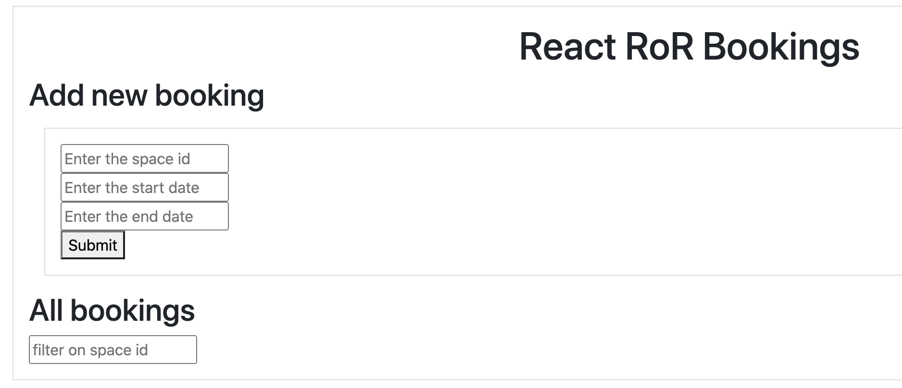

# README

* Ruby version

* System dependencies

* Configuration

rails new  rails_react_booking  --api--webpack=react

* Database creation

* Database initialization

* How to run the test suite

* Services (job queues, cache servers, search engines, etc.)

* Deployment instructions

* ...
